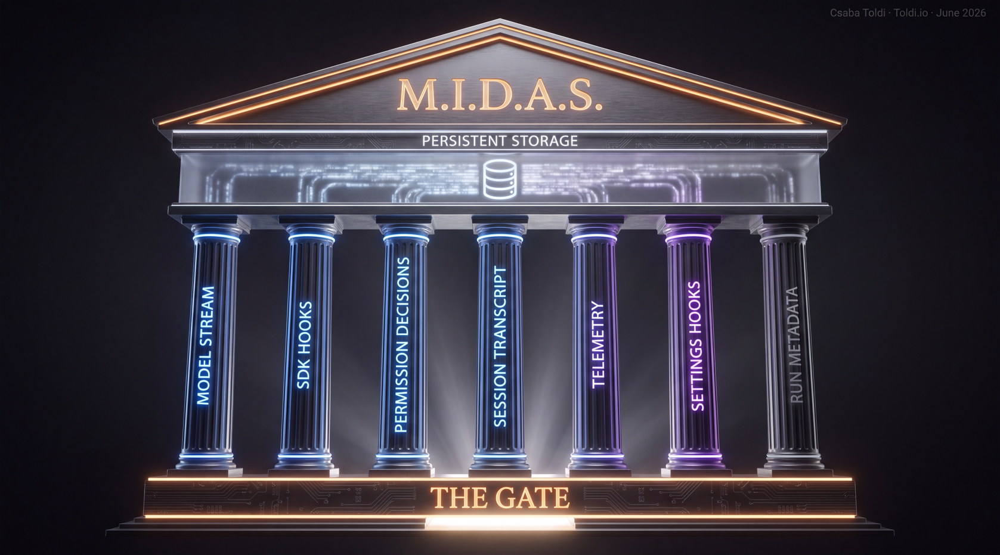

# 025 — a transparency substrate for the Claude Agent SDK

A sealed container that runs an AI coding agent (Anthropic's Claude Agent SDK, TypeScript) and records
**everything the agent does**, verbatim, into one SQLite database, by forcing every action through a
single instrumented gate. It is the public extract of **021**, the sealed reference build (described
below): the proven capture core, vendored byte-for-byte and run on real workloads.

The claim is narrow and falsifiable: *inside this slice (one SDK, one container, the standard tools),
almost nothing the agent does is hidden.* Not a black box. See [the thesis](docs/explanation/transparency-thesis.md).



> New here? **[START-HERE.md](START-HERE.md)** is the map: where everything is, and where to go for what you want.

## The two builds (021 and 025)

The numbers are workspace project IDs. The roles are what matter.

- **021, the reference build (sealed, not published).** The first build, where the capture was proven,
  then sealed and kept append-only. It is the faithful record of the whole journey, failures and SDK /
  agentic learnings included. It is deliberately raw and larger than is practical to read end to end,
  so it stays the evidence record, not a published product. Only the minimum slice needed to rebuild
  the core was carried into 025.
- **025, the public extract (this repo).** That proven core, lifted out, stripped of the test
  scaffolding, documented, and run on real work.

Sealing the faithful record and publishing only the clean extract is deliberate. The messy truth is
preserved intact; the clean proof is what gets shared.

## What it captures

Every agent action lands on up to **7 channels** into one canonical SQLite spine, joined per tool call:
**29 tools** (verified by a three-channel join) and **30 hooks** (on their assigned channels). The
exact lists are generated from the code, never hand-typed: [channels](docs/reference/channels.md) ·
[tools](docs/reference/tools.md) · [hooks](docs/reference/hooks.md) · [schema](docs/reference/schema.md).

It also runs an **honesty engine**: it computes, from the record, whether the agent's account of what
it did was truthful (silent failures, omissions, lies). See [honesty engine](docs/explanation/honesty-engine.md).

## Proven, not asserted

025's capture code is byte-identical to the sealed `021` core, and the built+running system reproduces
its records on identical input — graded **COMPLIES** by a blind, double-run judge against an immutable
contract. The proof: [evidence/](evidence/) (`PARITY-MANIFEST.md`, `PARITY-REPORT.md`,
`parity-contract.md`, `VERDICT.md`).

## Quickstart

```sh
docker compose build app && docker compose up -d
# the agent-free capture suite (no login needed):
docker exec 025_midas_public_v2_app npx vitest run
# run a real task (needs `claude login` in the container once):
# -> docs/how-to/run-on-a-real-workload.md
```

## Where to look

The full map is **[START-HERE.md](START-HERE.md)**: where every folder is, and where to go for what you want (the pitch, a real run in action, how it works, the facts, running it, the proof).

## Scope and boundary

The stack is **version-pinned** (the tool/hook surface belongs to one exact SDK/CLI; a bump re-opens
the proof). The slice is in-container, at the SDK surface and above; below-the-container kernel
monitoring (eBPF) is named as the boundary, not claimed. See [the pinned stack](docs/explanation/the-pinned-stack.md).

## License

[MIT](LICENSE).
